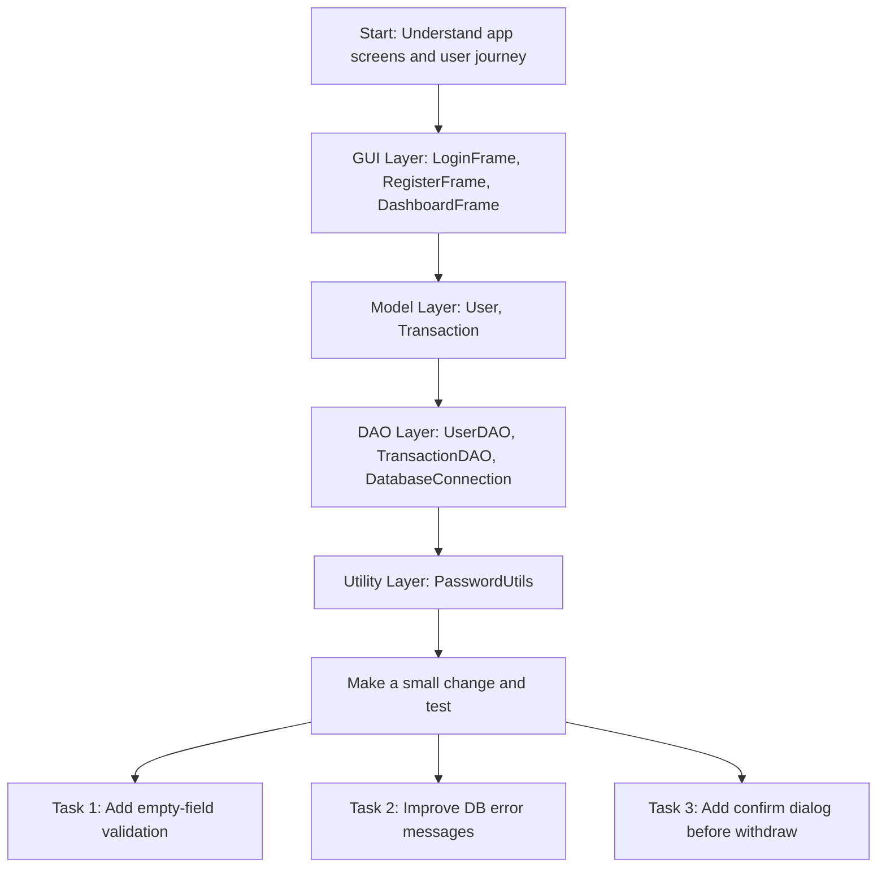

# Secure Digital Wallet (Java GUI + JDBC)(Group-22)

A simple class project built with Java Swing (GUI), JDBC, and MySQL.

## Features
- User registration and login
- Secure password storage using BCrypt hashing
- Deposit and withdraw operations
- Real-time balance refresh
- Recent transaction history (last 20)

## Tech Stack
- Java 11+
- Swing (desktop GUI)
- JDBC
- MySQL
- Maven

## Project Structure
```text
secure-wallet/
├── pom.xml
├── README.md
└── src/main/java/com/wallet/
    ├── WalletApp.java
    ├── database/
    │   ├── DatabaseConnection.java
    │   ├── UserDAO.java
    │   └── TransactionDAO.java
    ├── gui/
    │   ├── LoginFrame.java
    │   ├── RegisterFrame.java
    │   └── DashboardFrame.java
    ├── models/
    │   ├── User.java
    │   └── Transaction.java
    └── utils/
        └── PasswordUtils.java
```

## File-by-File Explanation

### Root Files
- `pom.xml`
  - Maven build configuration.
  - Declares dependencies (`mysql-connector-java`, `jbcrypt`).
  - Sets Java compiler version.
  - Configures jar packaging.

- `README.md`
  - Project documentation.
  - Contains setup steps, run commands, schema, and troubleshooting.

### Application Entry
- `src/main/java/com/wallet/WalletApp.java`
  - Main class (`public static void main`).
  - Initializes database tables on startup.
  - Launches Swing UI (`LoginFrame`) on the Event Dispatch Thread.

### Database Layer (JDBC)
- `src/main/java/com/wallet/database/DatabaseConnection.java`
  - Stores MySQL connection config (`DB_URL`, `DB_USER`, `DB_PASSWORD`).
  - Opens JDBC connection to MySQL.
  - Creates required tables (`users`, `transactions`) if not present.
  - Provides connection close method.

- `src/main/java/com/wallet/database/UserDAO.java`
  - Handles user-related SQL operations.
  - `registerUser`: inserts new user with hashed password.
  - `login`: verifies username/password and returns user object.
  - `usernameExists`: checks duplicate usernames.
  - `updateBalance`: updates wallet balance in DB.
  - `getUserById`: fetches latest user data from DB.

- `src/main/java/com/wallet/database/TransactionDAO.java`
  - Handles transaction-related SQL operations.
  - `saveTransaction`: stores deposit/withdraw records.
  - `getTransactionsByUserId`: gets latest 20 transactions for dashboard.

### GUI Layer (Swing)
- `src/main/java/com/wallet/gui/LoginFrame.java`
  - First screen shown to users.
  - Accepts username/password for login.
  - Opens register form when user clicks Register.
  - On successful login, opens `DashboardFrame`.

- `src/main/java/com/wallet/gui/RegisterFrame.java`
  - Registration form for new users.
  - Validates required fields and password confirmation.
  - Checks if username already exists.
  - Creates new user account through `UserDAO`.

- `src/main/java/com/wallet/gui/DashboardFrame.java`
  - Main wallet screen after login.
  - Displays user name and current balance.
  - Supports deposit and withdraw operations.
  - Writes each operation as a transaction record.
  - Displays recent transactions list.
  - Supports refresh and logout.

### Model Layer (POJOs)
- `src/main/java/com/wallet/models/User.java`
  - User data model.
  - Fields: id, username, password, email, balance.
  - Used to transfer user data between GUI and DAO layers.

- `src/main/java/com/wallet/models/Transaction.java`
  - Transaction data model.
  - Fields: id, userId, type, amount, timestamp, description.
  - Used for storing/displaying transaction data.

### Utility Layer
- `src/main/java/com/wallet/utils/PasswordUtils.java`
  - Security helper class.
  - `hashPassword`: hashes plain text passwords using BCrypt.
  - `verifyPassword`: checks login password against stored hash.

## Prerequisites
1. Java 11 or newer
2. MySQL Server running
3. Maven installed

Check versions:
```bash
java -version
mvn -v
mysql --version
```

## MySQL Setup
Create the database first:

```sql
CREATE DATABASE wallet_db;
```

Then configure DB credentials in `src/main/java/com/wallet/database/DatabaseConnection.java`:

```java
private static final String DB_URL = "jdbc:mysql://localhost:3306/wallet_db";
private static final String DB_USER = "root";
private static final String DB_PASSWORD = "your_mysql_password";
```

## Build and Run
From project root:

```bash
cd /Users/priyansh/Desktop/adj/secure-wallet
mvn clean compile
mvn exec:java -Dexec.mainClass="com.wallet.WalletApp"
```

## First Run Flow
1. App starts and creates tables automatically if missing:
   - `users`
   - `transactions`
2. Login window opens.
3. Click Register to create a user.
4. Login and use dashboard for deposit/withdraw operations.

## Learning Flowchart (Recommended Reading Order)
Use this path if you are new to the project and want to understand it quickly.



Quick tip:
- While reading each layer, trace one complete feature path (for example: Login button click -> DAO call -> user object -> Dashboard).

## Usage
### Register
- Open `Register`
- Enter username, email, password, confirm password
- Submit

### Login
- Enter username and password
- On success, Dashboard opens

### Dashboard
- `Deposit`: add money to account
- `Withdraw`: remove money (with balance checks)
- `Refresh`: reload balance and transaction list
- `Logout`: return to login screen

## Database Schema
`users` table:
```sql
CREATE TABLE IF NOT EXISTS users (
    id INT AUTO_INCREMENT PRIMARY KEY,
    username VARCHAR(50) UNIQUE NOT NULL,
    password VARCHAR(255) NOT NULL,
    email VARCHAR(100) NOT NULL,
    balance DOUBLE DEFAULT 0
);
```

`transactions` table:
```sql
CREATE TABLE IF NOT EXISTS transactions (
    id INT AUTO_INCREMENT PRIMARY KEY,
    user_id INT NOT NULL,
    type VARCHAR(50) NOT NULL,
    amount DOUBLE NOT NULL,
    timestamp DATETIME DEFAULT CURRENT_TIMESTAMP,
    description TEXT,
    FOREIGN KEY(user_id) REFERENCES users(id)
);
```

## Security Notes
- Passwords are hashed using BCrypt (`PasswordUtils`).
- SQL queries use `PreparedStatement` to reduce SQL injection risk.
- The app does basic input validation for amounts and credentials.

## Troubleshooting
### `Access denied for user`
- Verify `DB_USER` and `DB_PASSWORD` in `DatabaseConnection.java`.

### `Unknown database 'wallet_db'`
- Run:
  ```sql
  CREATE DATABASE wallet_db;
  ```

### `Communications link failure`
- Ensure MySQL server is running.

### `mvn: command not found`
- Install Maven:
  ```bash
  brew install maven
  ```

## Package JAR
```bash
mvn clean package
java -jar target/secure-wallet-1.0.0-jar-with-dependencies.jar
```
## OUTPUT


## Author Notes
This project is intentionally simple and class-project friendly, focused on clear architecture:
- GUI layer (Swing)
- DAO layer (JDBC)
- Model layer (POJOs)
- Utility layer (security)
